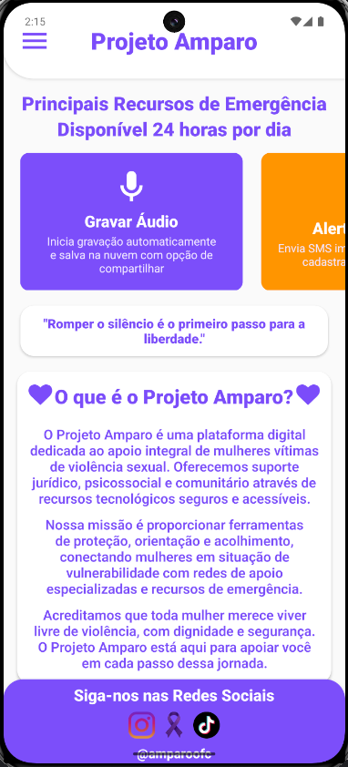
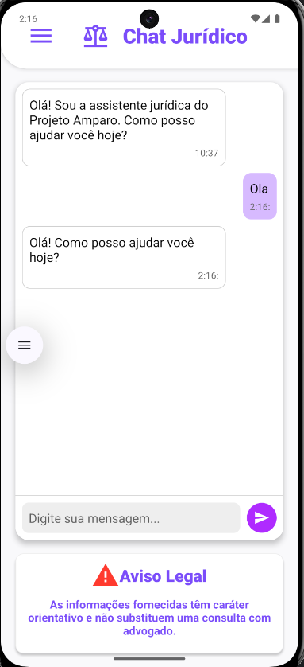
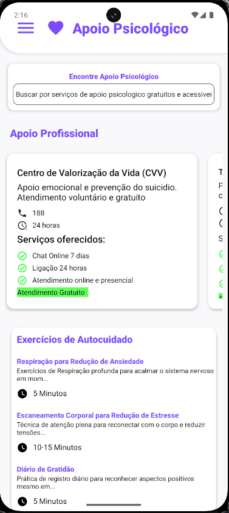

# 💜 Projeto Amparo
O **Projeto Amparo** é um aplicativo desenvolvido em **React Native (Expo + EAS Build)** com o propósito de **ajudar mulheres que sofreram violência**.  
O app oferece informações, recursos de emergência e ferramentas práticas para buscar ajuda de forma rápida, segura e humanizada.

> ⚠️ *Projeto finalizado, objetivo concluido*

## Objetivo

Criar um aplicativo, um protótipo, para validar uma ideia, um espaço seguro e acessível para que mulheres possam:
- Entender seus **direitos**
- Saber **como e onde denunciar**
- Encontrar **delegacias próximas**
- Acionar **contatos de emergência**
- Criar **um plano de fuga**
- Gerar **relatórios em PDF** com informações relevantes

##  Funcionalidades

-  **Informações e direitos**: orientações sobre leis, tipos de violência e canais de denúncia
-  **Contatos de emergência** com envio automático de **mensagem**  
-  **Gravação de áudio de emergência** 
-  **Criação de plano de fuga personalizado e geração de relatório em PDF**
-  **ChatIA para tirar dúvidas**

## 🧩 Tecnologias usadas

| React Native | SQLite |
| Expo | OpenAI API |

## 📦 Download do App

Esta versão foi criada com **EAS Build (Dev Client)** — não depende do Expo Go.  
Você pode instalar o APK no Release do repositorio:

> Compatível com Android **7.0 (Nougat)** ou superior. 
> Versão: *Preview – em desenvolvimento.*

## 📸 Demonstração

| Tela Inicial | Chat Jurídico | Apoio Psicológico |
|---------------|--------------------|--------------------------|
|  |  |  |

 [**Acompanhe a iniciativa Amparo**](https://linktr.ee/amparoofc?fbclid=PAZXh0bgNhZW0CMTEAAacRpK_nTAC1_9dZA5MQNfFDPutoSjCGjNwSjlbeKW5mkeIFCtjFOXTwSscjhw_aem_C_V0zv7Um-dMZcCxR9CZDw)

